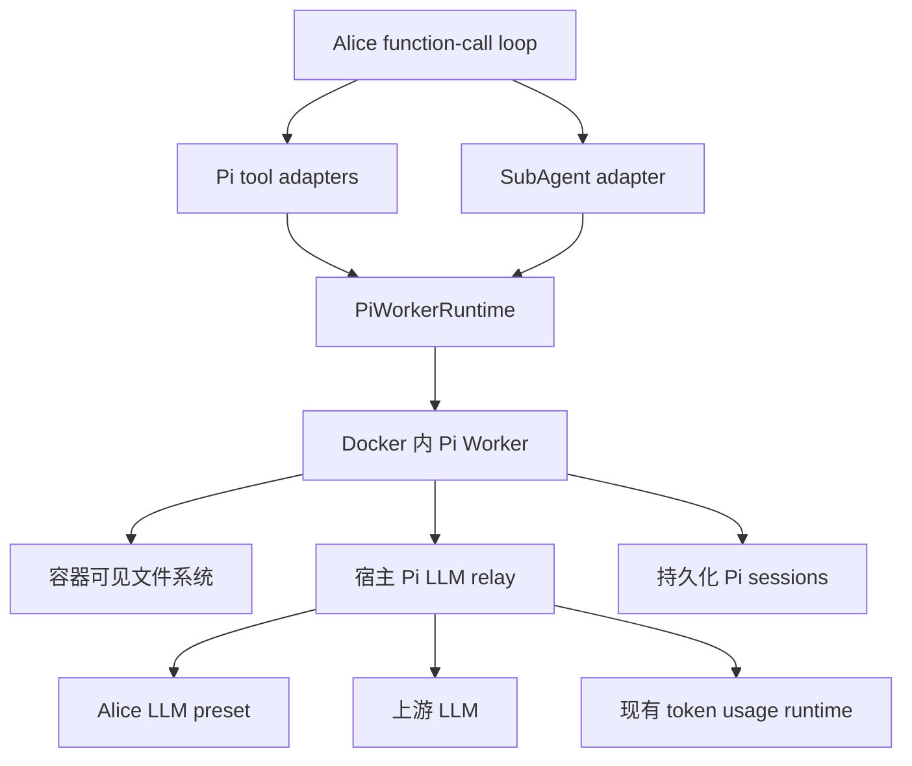

# 沙箱 Agent、编码工具与 LLM Relay 重构设计

## 文档状态

- 状态：目标与主要语义已确认，等待实现。
- 范围：Alice 的沙箱编码工具、沙箱内 Pi Worker、SubAgent、宿主侧 Pi LLM relay、Pi 插件设置页、Agent 状态联动和 token usage 统计。
- 执行安全前提：Docker 容器是 Pi Worker、Pi tools 和 SubAgent 的唯一执行边界；容器内可见路径均允许访问。
- 密钥安全前提：上游 LLM API key 不进入 Docker 容器。Pi 只持有随机 capability token，通过宿主侧 relay 使用选中的 Alice LLM preset。

## 背景

Alice 当前通过 `ToolPlugin` 暴露 `Read`、`Edit`、`Glob`、`Grep` 和 `Bash`，具体文件与命令操作最终由 `bash-sandbox` 在 Docker 容器内执行。文件工具维护了一套 Alice 自有的读取、编辑、路径限制和输出转换语义，沙箱容器本身以 `sleep infinity` 作为常驻进程。

本次重构在每个沙箱容器启动时同时启动 Pi Worker，让 Alice 的 `Read`、`Write`、`Edit`、`Bash` 直接转发到 Pi 原生工具，并新增非阻塞 `SubAgent` 工具。旧文件工具中只保留 `Glob`；旧 `Read`、`Edit`、`Grep`、`Bash` 实现不保留兼容层。

Pi Agent 复用 Alice 已有的 LLM preset，但上游 API key 不写入 Pi 的 `auth.json`、`models.json`、容器环境变量或容器文件。宿主侧新增受限的 OpenAI-compatible relay：容器只拿到随机 capability token，relay 在宿主侧解析 preset、添加真实鉴权、转发响应并接入现有 usage 统计。

## 已确认决策

1. `Read`、`Write`、`Edit`、`Bash` 的参数接口和执行语义以运行时安装的最新版 `@earendil-works/pi-coding-agent` 为准。
2. Alice 对外继续暴露大写工具名；Pi Worker 内使用 Pi 原生小写工具名。大小写映射和框架 envelope 转换是 adapter 唯一允许的接口差异。
3. 四个转发工具不在 Alice 中手写或复制 description、参数 schema、校验、截断和结果语义；Worker 从实际安装的 Pi 导出工具定义。
4. 不固定 Pi 版本。构建或安装时使用 `@earendil-works/pi-coding-agent@latest`，Worker health 必须报告实际解析版本，测试以该实际版本为基准。
5. 每次沙箱容器启动都同时启动 Pi Worker；不存在禁用 Pi 或按第一次调用懒启动 Pi 的配置。
6. 旧编码工具只保留 Alice 的 `Glob`。不保留旧 `Read`、`Edit`、`Grep`、`Bash`，也不提供兼容 fallback。
7. Docker 容器是唯一文件和命令执行边界。Pi tools、SubAgent 可以访问容器内全部可见路径；Alice adapter 不再增加 allowed-root 路径限制。
8. SubAgent 共享同一沙箱 workspace；当前阶段不实现写入冲突检测、文件合并、worktree 隔离或写入锁。
9. 每个 SubAgent invocation 对应一个持久化 Pi AgentSession 上的一次 invocation；session id 由 Pi 生成并永久定位 session，invocation id 使用 Pi JSONL entry id。会话记录以 Pi session 和最小 `alice_pi_invocation` custom entry 为真相源，不再维护一份 Alice 自有 task registry。
10. Worker 或容器停止时，运行中的任务必然中断，不做也不声称无缝恢复。重启后将最后状态仍为 queued/running 的 Pi session 标记为 `interrupted`，保留历史记录但不重新执行。
11. Alice 进程单独重启且容器/Worker 仍存活时，可以重新连接 Worker 并读取当前 Pi sessions；正式的 systemd restart 会停止容器，因此该路径上的任务按中断处理。
12. `SubAgent.start` 非阻塞：Pi session 创建并进入 queued/running 后立即返回 Pi 生成的 `sessionId` 与当前 invocation 状态，不等待完成。
13. Pi Agent 完成后，直接提取该 AgentSession 的最终 assistant 输出，作为 `both` completion message 正文进入 Alice 现有消息链并发送给 invocation 目标；主 Agent 不必再调用 `status` 才能取得完整结果。
14. `SubAgent.status` 返回 session 是否 idle 与当前/最近一次 invocation 状态；`read` 直接读取 Pi 原生 context/messages/tree；`cancel` 幂等调用对应 Pi `AgentSession.abort()`，session 之后仍可 `send`。
15. ChatAgent activate 时先进入 `waiting`。只要存在 queued/running Pi SubAgent invocation，Agent 状态锁定为 `waiting`，`nextTransitionAt` 保持 `undefined`，所有离开 `waiting` 的状态切换都被拒绝。
16. 最后一个活跃 invocation 完成并且 completion message 已可靠插入后，才解除 `waiting` 锁；completion message 的正常处理结束后再恢复 inactivity deadline。
17. `SubAgent` 当前只进入 ChatAgent/Core 的 visible tools；TalkAgent 不暴露 `SubAgent`，因此不存在 `calling` 状态下启动 SubAgent 的语义。
18. Pi prompt 不可配置。Pi 插件页只展示 session 创建完成后的最终 `session.agent.state.systemPrompt`；未来提供配置能力记为 TODO。
19. Worker 不额外拼接、前置、包裹任何 Pi prompt。preview 展示的字符串必须与对应 session 实际使用的 `session.agent.state.systemPrompt` 完全一致。
20. Pi 插件页增加 Alice LLM preset 选择。上游 API key 只保留在 Alice 宿主侧 preset 存储，不写入 Pi 配置。
21. 宿主侧 LLM relay 使用随机高熵 capability token。token 只标识受限规则，不包含上游 API key、base URL 或其他凭据。
22. capability token 通过 `PI_LLM_RELAY_TOKEN` 注入容器环境；relay 地址通过 `PI_LLM_RELAY_URL` 注入。Agent 可以读到该 token，因此它不是容器内秘密，而是一项受限使用能力。
23. capability token 在容器生命周期内保持不变；切换 preset 只更新宿主侧规则和新 session 的 preset snapshot。容器重建时轮换 token，旧 token 立即失效。
24. relay 只允许绑定 preset/model 的 LLM 请求，不允许调用方指定任意上游 URL、替换真实 Authorization、切换未授权 preset 或访问 Alice 其他管理接口。
25. Pi 上游响应的 usage 由 relay 旁路采集，并通过现有 `recordTokenUsageEvent()` 写入 Alice token usage store，使用 `agentId: "pi"`。Pi session usage 不重复写入统计。
26. `AbortSignal` 贯穿当前 LLM run、`ToolExecutionContext`、Pi adapter、PiWorkerRuntime、Worker 和同步 Pi tool；后台 SubAgent 使用显式 cancel(sessionId) 中止当前 invocation。
27. 删除 Alice 原有 Bash `audit.jsonl` 记录链，不迁移、不兼容，也不在 Pi adapter 或 relay 中重建等价审计。
28. 每次实际 wake 生命周期都重启一次沙箱容器：任一成功的 `sleeping -> waiting` 转换，包括普通 wake 和 force wake，先重建容器并等待新 Worker ready，再处理对应的早晨/强制唤醒后续流程。

## 非目标

- 不恢复 Worker/容器停止前正在执行的 tool 或 SubAgent。
- 不把 Pi prompt 合并进 Alice Core、Talk 或 Memorize prompt layer。
- 不提供宿主机文件系统或宿主机 shell fallback。
- 不把上游 API key 复制进 Pi `auth.json`、`models.json` 或容器环境。
- 不阻止容器内 Agent 使用 capability token 调用受限 relay；安全目标是不可读取和不可导出上游 key，并限制 token 可使用的能力。
- 不在当前阶段解决多个 SubAgent 对同一 workspace 的并发写入冲突。
- 不在当前阶段为 Pi 字符串 session id 扩展 token usage store 的 `sessionId` 字段；Pi usage 先按 `agentId` 和 model 聚合。
- 不保留 `Grep`。后续如需搜索内容，单独决定是否转发 Pi 原生 `grep`。
- 不要求 Pi prompt 可配置；配置能力仅记录 TODO。

## 总体架构



### 模块 seam

本方案使用三个主要模块：

1. `PiWorkerRuntime`
   - 对 Alice 暴露少量 tool/session/lifecycle interface。
   - 隐藏 Worker 协议、readiness、request cancel、容器重建和 capability token 注入。
2. `Pi Worker`
   - 对宿主暴露 health、tool definitions、tool execution 和 session 操作。
   - 隐藏 Pi SDK、AgentSession、SessionManager 和事件流实现。
3. `Pi LLM Relay`
   - 对 Pi 暴露受限 OpenAI-compatible interface。
   - 隐藏 Alice preset、真实上游地址、真实 API key、usage 解析与统计写入。

删除任一模块时，其内部复杂度都会重新散落到多个调用方，因此这些 seam 具有实际深度，不是单纯 pass-through。

## 沙箱与 Worker 生命周期

### 容器启动

现有容器以 `sleep infinity` 常驻。重构后容器入口直接启动受管理的 Pi Worker；不得等到第一次 tool call 才安装或启动。

容器进入 ready 需要同时满足：

- 容器处于 running；
- Pi Worker 进程存活；
- Worker 能访问配置的 cwd；
- Worker 能加载当前最新版 Pi；
- Worker health 返回 Pi 实际版本和 tool definition generation；
- Worker 能访问 `PI_LLM_RELAY_URL`；
- 当前 capability token 在 relay 中有效；
- Worker health 请求成功。

### 容器重建

以下事件需要重建容器：

- mount key 变化；
- 管理员显式重建沙箱；
- 每次实际 wake 生命周期；
- 容器配置发生必须重建的变化。

重建流程：

1. 停止接受新请求；
2. 使旧 capability token 失效；
3. 停止并删除旧容器；
4. 创建新的随机 capability token 和宿主侧规则；
5. 创建新容器并注入 relay URL/token；
6. 启动 Pi Worker；
7. 等待 Worker health ready；
8. 扫描 Pi session 列表，将遗留 queued/running session 标记为 `interrupted`；
9. 恢复新请求。

正在运行的同步 tool 统一失败为 `sandbox_restarted`。运行中的 SubAgent 保留 Pi session，但终态变为 `interrupted`，不重新执行。

### Wake 重启

Wake 重启绑定到实际状态转换，而不是某个 UI 按钮：

```text
previousState == sleeping
  && nextState == waiting
  => restart sandbox exactly once
```

普通 `sleep_cocoon.wake` 和 `sleep_cocoon.force_wake` 都遵守该规则。重启必须在 wake 后续 Agent run 之前完成；新 Worker 未 ready 时不得启动早晨或强制唤醒后的 Pi tool/SubAgent。

由于活跃 SubAgent 会把 Agent 状态锁在 `waiting`，正常情况下 wake 重启发生时不存在合法的 queued/running SubAgent；仍需保留异常遗留 session 的 `interrupted` 收尾。

### Worker 或 Alice 停止

- Worker 意外退出：当前同步请求失败；活跃 Pi sessions 在下一次 Worker 启动时标记为 `interrupted`。
- 容器停止：与 Worker 退出相同，不恢复执行。
- Alice API 进程单独退出、Worker 仍存活：新 Alice 进程可重新连接并读取 Worker 当前 sessions。
- `systemctl --user restart alice-agent-tmux.service`：当前脚本会停止沙箱容器，因此不属于 Worker reconnect，所有活跃执行按中断处理。
- Pi session 文件必须位于持久化 mount；容器删除不得删除历史 sessions。

## Pi LLM Relay

### 安全模型

Pi 官方 `auth.json` 可以明文保存 API key，即使文件权限为 `0600`，也不适合作为同一容器内 Agent 的秘密存储。Alice 当前 LLM preset 同样包含明文 key，因此 preset 文件只保留在宿主侧，绝不挂载进沙箱。

relay token 是 capability，不是容器秘密。Agent 可以通过环境或 Bash 读取它，但其能力被宿主侧规则限制：

- 只能访问 LLM relay 路由；
- 只能使用绑定的 preset/model；
- 不能读取真实 upstream key；
- 不能选择任意 upstream URL；
- 不能转发任意 Authorization；
- 受 body size、并发、timeout 和可选 rate limit 限制；
- token 失效后所有请求立即拒绝。

### 网络与认证

建议环境变量：

```text
PI_LLM_RELAY_URL=http://host.docker.internal:<dedicated-port>/v1
PI_LLM_RELAY_TOKEN=<random-256-bit-token>
```

Pi 使用：

```http
Authorization: Bearer <PI_LLM_RELAY_TOKEN>
```

relay 使用独立监听端口和独立路由，不复用 Admin 路由。监听地址必须能从目标 Docker bridge 到达；不得因为开放端口而暴露其他 Alice 管理能力。

### Token 与规则生命周期

宿主内存维护：

```ts
type PiRelayCapability = {
  tokenHash: string;
  sandboxId: string;
  active: boolean;
  preset: PiRelayPresetSnapshot;
};
```

规则只保存 token hash，不在日志中输出原 token。capability 直接持有创建时的 preset snapshot；运行中的 session 保持创建时 preset，不因管理员随后切换默认 preset 而改变。preset 配置变更通过配置重载/容器重建产生新 capability snapshot，不在运行中暗改旧 capability；容器重建时整代 capability 失效。

### LLM preset 映射

Pi 插件设置保存 `llmPresetName`，引用 Alice 现有 LLM preset。创建 Pi session 时取得 snapshot，并显式转换：

| Alice preset 字段 | Pi/relay 行为 |
|---|---|
| `name` | 仅作为宿主侧 preset 引用，不发给上游 |
| `baseURL` | 仅由 relay 用作上游地址，不进入容器 |
| `apiKey` | 仅由 relay 添加到上游 Authorization，不进入容器 |
| `model` | Pi model id，同时由 relay 校验 |
| `temperature` | 转换为 Pi model sampling parameter |
| `maxTokens` | 转换为 Pi model maxTokens；未配置时使用 Pi 默认 |
| `timeoutMs` | relay 上游请求 timeout |
| `supportsImage` | 转换为 Pi model input capability |
| `supportsAudio` | 当前 Pi SubAgent 不使用，不转换 |
| `extraParams` | 只允许显式批准的 Pi-compatible sampling 参数 |
| `followupExtraParams` | 不转换；Pi 自己维护 agent/tool loop |

禁止原样复制 `extraParams`。Alice preset 中现存的 `tool_choice`、`stream_options`、Alice 首轮/后续轮次控制等会改变 Pi 工具调用语义，必须在保存/选择 preset 时明确报不兼容配置错误，不能静默忽略，也不能隐藏 fallback。

Pi 自己生成 `stream_options.include_usage`、tool schema、tool choice 和 agent loop 请求结构。relay 除鉴权、上游地址和已经确认的 preset mapping 外，不改写 Pi 请求语义。

### Relay 请求与响应

首版只支持 Pi 当前使用的 OpenAI Chat Completions 路径：

```text
POST /v1/chat/completions
```

relay 流程：

1. 常量时间校验 bearer token；
2. 校验 token 状态、来源 sandbox、请求路径、body size 和并发；
3. 根据 Pi session id 取得不可变 preset snapshot；
4. 校验请求 model 与 snapshot 一致；
5. 丢弃调用方 Authorization 和所有禁止转发的认证头；
6. 使用 snapshot 的 baseURL/apiKey 请求上游；
7. 原样转发上游状态码、headers 白名单和响应 body/SSE；
8. 旁路提取 usage；
9. 请求结束后写入现有 token usage runtime。

上游错误保持原错误性质和状态码，不伪造成功，不 fallback 到其他 preset。

### Usage 统计

现有 `recordTokenUsageEvent()` 已接受任意字符串 `agentId`，因此 relay 可以直接复用：

```ts
recordTokenUsageEvent({
  createdAt,
  createdAtUtc,
  agentId: "pi",
  model: preset.model,
  result
});
```

- 非流式响应：从最终 JSON 提取 usage。
- 流式响应：逐字节原样转发 SSE，同时旁路解析最终 usage chunk。
- 复用现有 input/output/total/cache hit/cache miss normalization。
- 保存上游原始 usage JSON。
- Admin usage 页增加 `pi` agent 筛选项。
- relay 是 Alice 侧 Pi usage 的唯一写入者；Worker 的 Pi usage event 不再次写入，防止重复计数。
- 当前 `token_usage_events.session_id` 是数字，Pi session id 是字符串；首版留空该字段，按 `agentId=pi` 和 model 聚合。未来如需 task 级 usage，再单独设计 schema migration。

## 编码工具接口

### 动态定义与名称映射

Worker ready 后返回当前 Pi 实例的 built-in tool definitions：

| Alice 对外名称 | Pi Worker 名称 |
|---|---|
| `Read` | `read` |
| `Write` | `write` |
| `Edit` | `edit` |
| `Bash` | `bash` |

Alice tool registry 使用 Worker 返回的 description 和 schema，只改 tool name 大小写。adapter 转换 `AgentToolResult` 与 Alice `ToolResult` envelope，但不改变 Pi 返回文本、错误、截断和 details 的业务含义。

`Glob` 继续使用 Alice 现有实现。`Grep` 删除且不替换。

### 路径语义

- 相对路径按 Pi session/tool cwd 解析。
- 绝对路径允许访问容器内所有可见路径。
- 不保留 Alice allowed roots 检查。
- Docker 的 read-only rootfs、mount mode、用户、network、resource limit 仍决定实际权限。
- 任一 Pi tool 失败时直接返回错误，不回落宿主机 `fs` 或 shell。

### Read 图片

Pi `read` 返回图片 content 后，Alice 根据当前调用实际模型预设处理：

1. 模型支持图片：保留 Pi image content，写回同一个 function-call loop。
2. 模型不支持图片：把 Pi image content 交给现有 image-recognition plugin，使用识别文本构造当前 tool result。
3. image recognition 失败：当前 `Read` 返回错误，不伪造成功文本。

### Write、Edit、Bash

三者完全采用当前 Pi 原生定义。Alice 不再列出固定参数结构，避免最新版 Pi 更新后文档或实现复制过期 schema。验收以 Worker 实际导出的定义和对应 Pi tool 行为为准。

## AbortSignal

`ToolExecutionContext` 增加可选 `signal?: AbortSignal`，执行链：

```text
Alice LLM run
  -> ToolExecutionContext.signal
  -> Pi adapter
  -> PiWorkerRuntime cancel(requestId)
  -> Worker request AbortController
  -> Pi 原生 tool/agent abort
```

- `AbortSignal` 不决定 tool 可见性。
- Alice 不识别 Bash PID/进程组，不自行发送 POSIX 信号。
- 同步 tool abort 只取消对应 request。
- `SubAgent.start` 仅在创建 Pi session 前受父 run signal 影响。
- 已接受的 SubAgent 不跟随父 run 取消；后续使用 `cancel(sessionId)` 中止当前 invocation。
- 容器重建是生命周期中断，不伪装成普通 request abort。

## SubAgent

### Tool interface

> 术语修正：本小节已按 2026-08-05 第二步设计文档（`2026-08-05_pi-worker-agent-refactor-step2.md`）对齐。Pi session 是可重复 invocation 的持久化 AgentSession，不是一次性 task；所有 action 统一使用 `sessionId`，invocation 只使用 Pi JSONL entry id。

首版保留一个普通 `ToolPlugin`，提供：

```ts
type SubAgentInput =
  | { action: "start"; message: string; timeoutSeconds?: number }
  | { action: "list" }
  | { action: "read"; sessionId: string; view?: "context" | "messages" | "tree" }
  | { action: "send"; sessionId: string; message: string; mode?: "prompt" | "steer" | "follow_up"; timeoutSeconds?: number }
  | { action: "status"; sessionId: string }
  | { action: "wait"; sessionId: string; timeoutSeconds?: number }
  | { action: "cancel"; sessionId: string }
  | { action: "fork"; sessionId: string; entryId?: string };
```

模型、thinking、tools 和其他 Pi 已有设置不在 `SubAgent.start` 重复定义；它们来自 Pi 插件设置、当前 Alice LLM preset 转换和 Pi 原生 defaults。当前四个转发工具直接使用 Pi definitions，`Glob` 属于 Alice 主 Agent，不注入 Pi SubAgent。

`start` 创建持久化 Pi AgentSession，追加最小 `alice_pi_invocation` custom entry（保存 invocation 的消息目标与 timeout），并发起第一次 invocation，然后立即返回：

```ts
{
  invocationId: string, // Pi JSONL entry id
  sessionId: string,    // Pi 生成的 session id
  status: "queued" | "running"
}
```

### Session 作为任务真相源

不建立 Alice task registry。Worker 使用 `SessionManager.list/listAll` 和每个 session 的 Pi 原生 entries 得出：

- Alice message target（保存在 `alice_pi_invocation` custom entry）；
- invocation 的 queued/running/failed/interrupted/timed_out/aborted 状态；
- invocation timeout；
- 最终 assistant 输出或准确错误。

Worker 内存可以持有当前 AgentSession、invocation 队列和活跃 invocation 索引，但它们只是可重建的运行时 projection，不能成为唯一记录。

### Invocation 终态与 completion message

invocation 终态包括：

- `completed`
- `failed`
- `timed_out`
- `aborted`
- `interrupted`

成功时直接取 Pi session entries 中最终 assistant 输出作为 completion text；失败类终态使用准确错误文本。`piSessionId + piInvocationId`（两者都来自 Pi）在 Message Store 中唯一确定一条 `both` 逻辑消息，用于去重。

流程：

1. invocation 开始时 Pi session 追加最小 `alice_pi_invocation` custom entry；
2. Worker/Alice 观察到 invocation 完成；
3. `MessageRuntime.deliverPiInvocationCompletion()` 创建或取得唯一 `both` 消息，加入 Core pending，并以 system notice 形式发送给 invocation 目标；
4. 分别更新 `isRead`、`coreProcessedAt` 与 `sending/sent/send_failed`；
5. Alice/Worker 重连时通过 `/reconcile` 扫描未 delivery 的 invocation 并幂等重试。

不再单独建立 completion outbox；Pi session entries 与 Message Store `both` 消息共同提供 at-least-once delivery。

### Status

`status` 返回：

- session 是否 idle；
- 当前 invocation 的 queued/running 状态，或最后一次 invocation 的终态；
- 通过 `read` 直接读取 Pi 原生 context/messages/tree。

主 Agent 已从 completion message 得到完整最终输出，通常不需要为了正文再查询 `status`。

### Agent 状态锁

ChatAgent activation 先执行：

```text
agentState.activate("chat")
  -> state = waiting
```

第一个 Pi session 进入 queued/running 时取得通用 activity hold。`agentState` 在自己的 state transition seam 内保证：

```ts
activePiSubAgentCount > 0
  => state === "waiting"
  && nextTransitionAt === undefined
```

`agentState` 不直接依赖 Pi SDK；Pi runtime 只向它提交 activity hold acquire/release。锁存在期间，timer、tool、admin 和其他调用方请求离开 `waiting` 都得到明确拒绝，不静默改写。

最后一个活跃 session 终止时：

1. 先可靠插入 completion message；
2. 再释放 activity hold；
3. completion message 继续沿现有 new-message 路径处理；
4. run 结束且没有其他活动后重算 inactivity deadline。

## Pi prompt 与设置页

### Prompt preview

当前不提供 Pi prompt 编辑器。设置页创建一个使用当前配置的 preview session，并展示：

```ts
session.agent.state.systemPrompt
```

preview 必须读取最终 session 状态，不能根据若干配置字段自行拼接近似文本。Worker 不增加隐藏 prompt。未来若需要自定义 Pi prompt，必须作为单独 TODO 重新设计，并保证可编辑内容、固定块和最终顺序全部可见。

### 配置归属

建议非敏感配置文件：

```text
config/plugin/pi/config.json
```

首版 Alice-owned 配置只包含 Worker/队列/relay 运行参数和 preset 引用；Pi 已有模型、thinking、session、tool definition 语义直接使用 Pi，不复制一套同名配置。

建议字段：

| 配置 | 类型 | 说明 |
|---|---|---|
| `llmPresetName` | string | 引用现有 Alice LLM preset |
| `sandboxCwd` | string | Pi tool 和 Agent 的容器内 cwd |
| `maxConcurrency` | number | Worker 同时运行的 SubAgent 数量 |
| `maxQueueSize` | number | 等待队列上限 |
| `taskTimeoutSeconds` | number | 默认 SubAgent timeout |
| `toolTimeoutSeconds` | number | 同步 tool 默认 timeout |
| `workerStartupTimeoutMs` | number | Worker readiness timeout |
| `relayHost` | string | 宿主 relay 监听地址 |
| `relayPort` | number | 独立 relay 端口 |

不提供：

- `enabled`；
- Pi API key；
- 可编辑 Pi prompt；
- Alice 自行复制的 Pi tool definitions；
- Alice 自行复制的 Pi model/thinking 配置。

随机 capability token 不写入 `config.json`。它由 runtime 生成，更新当前进程状态，并在创建容器时注入；不得通过 Admin API 返回 token 明文。

## 旧 Bash audit 删除

实现时删除：

- `src/contexts/bash-sandbox/src/audit.ts`；
- `appendBashAuditEvent()` 调用和 audit event 构造；
- `BashSandboxConfig.auditLogPath`；
- `BASH_SANDBOX_AUDIT_LOG_PATH` 环境变量；
- Admin Bash sandbox 设置页中的 Audit Log Path；
- 只验证 `audit.jsonl` 的测试。

Alice function-call/session 日志、Pi session events 和 token usage 统计继续存在，但不新增 Bash 专用审计格式。

## 模块建议

```text
src/contexts/pi-worker/
  src/config.ts
  src/contracts.ts
  src/pi-worker-runtime.ts
  src/pi-worker-client.ts
  src/pi-session-projection.ts
  src/pi-relay-capability.ts

src/contexts/llm-gateway/
  src/pi-llm-relay.ts
  src/pi-preset-adapter.ts

src/capabilities/tools/pi/
  src/pi-tool-adapter.ts
  src/subagent-tool.ts

src/apps/api/
  bootstrap/pi-runtime wiring
  Pi plugin admin routes

infra/pi-worker/
  container entrypoint
  worker protocol implementation
```

不为只有一个实现的地方提前制造额外 adapter。`Pi LLM Relay` 复用现有 LLM preset 和 token usage interface，不复制 usage store 或上游客户端语义。

## 实现阶段

### 阶段一：Relay、最新版 Pi 与 Worker

- 新增专用 Pi LLM relay。
- 实现随机 capability token、token hash、规则 generation、容器注入和撤销。
- 接入 Alice LLM preset snapshot 和安全字段转换。
- 复用现有 usage normalization/recording。
- 使用最新版 Pi 构建/安装 Worker。
- 容器启动即启动 Worker，health 返回 Pi 实际版本和动态 tool definitions。

### 阶段二：编码工具迁移

- 动态注册 `Read`、`Write`、`Edit`、`Bash` adapters。
- 保持统一 `ToolPlugin.execute`。
- 实现文本、图片、多模态、错误和 details envelope 转换。
- 删除旧 Read/Edit/Grep/Bash wrapper 核心和 read-state。
- 保留 `Glob`。

### 阶段三：取消、audit 与生命周期

- 给 `ToolExecutionContext` 增加 `signal` 并贯穿到 Pi。
- 删除 Bash audit 全链。
- 实现容器重建、token 轮换、遗留 session interrupted 收尾。
- 将普通 wake 和 force wake 接入一次性容器重启，并在后续 wake run 前等待 ready。

### 阶段四：SubAgent 与 Agent 状态

- 新增 `SubAgent start/list/read/send/status/wait/cancel/fork` 完整 action。
- 使用持久化 Pi session 与最小 `alice_pi_invocation` custom entry 作为真相源。
- 实现按 invocation 计算的并发队列、timeout、cancel、interrupted。
- 最终 assistant 输出直接进入 `both` completion message。
- 复用 Message Store `piSessionId + piInvocationId` 去重，不建立独立 task registry/outbox。
- 实现 ChatAgent activate→waiting 和 activity hold 状态锁。

### 阶段五：Admin 与清理

- Pi 插件页增加 Alice LLM preset 选择、Worker/relay 配置和 health。
- 展示最终 `session.agent.state.systemPrompt`，不可编辑并标记 TODO。
- token usage 页增加 `pi` 筛选。
- 更新部署、沙箱、工具和安全文档。

## 测试与验收

### Relay 与密钥

- 容器及其 mounts 中不存在 Alice preset 文件、上游 API key、Pi `auth.json` literal key。
- Agent 使用 Read/Glob/Bash 无法取得上游 key。
- Agent 可以读到 capability token，但只能调用绑定的 relay 路由和 preset/model。
- 任意 URL、任意 Authorization、错误 model、超限 body、失效 token 均被拒绝。
- token 比较使用常量时间逻辑；日志不输出 token。
- 容器重建后旧 token 立即失效，新 token 生效。
- preset 修改只影响新 session；运行中 session 保持创建时 snapshot。

### Usage

- 非流式 relay 响应只写入一条 `agentId=pi` usage event。
- 流式 SSE 原样返回 Pi，并从最终 usage chunk 写入一条事件。
- input/output/total/cache hit/cache miss 与上游一致。
- Worker usage event 不产生第二条统计。
- Admin usage 页可筛选 `pi`。

### 沙箱与生命周期

- 每次新容器启动都会自动启动 Worker。
- Worker health 返回实际 Pi 版本和当前四个 tool definitions。
- mount 变化、显式重建和每次 wake 都产生新容器、新 Worker、新 token。
- 普通 wake 与 force wake 每次状态转换只重启一次，且后续 wake Agent run 等待 Worker ready。
- Worker/容器停止后 running session 变为 interrupted，不恢复执行。
- Pi session 文件在容器删除后仍存在。

### Tool contract

- 四个 tool schema 与当前安装的 Pi 动态定义一致，除名称大小写外无差异。
- `Read` 覆盖文本、截断、空文件、图片和容器内绝对路径。
- 支持图片模型收到 image content；不支持时调用 image-recognition。
- `Write`、`Edit`、`Bash` 的行为以当前 Pi 原生测试为准。
- `Glob` 仍可用；`Grep` 不再注册。
- Pi 失败后不存在宿主机执行 fallback。

### Loop 与取消

- 所有工具仍通过统一 `ToolPlugin.execute`。
- tool result 写回发起它的同一个 function-call loop。
- visible tools 未暴露的 Pi tool 不进入 LLM request。
- 不按 requester、channel、loop kind 或 tool name 在执行期二次拦截。
- 同步 Pi tool 可由当前 request signal 取消。
- 已接受 SubAgent 不因父 run 结束而取消。

### SubAgent 与状态

- `start` 返回 Pi 生成的 `sessionId` 与当前 invocation 状态；同一 session 完成后仍可 `send`。
- `start` 不等待 AgentSession 完成。
- 不存在 Alice 自有 task registry；重启后的状态来自 Pi sessions/custom entries。
- invocation completion 直接包含最终 assistant 输出。
- 相同 `piSessionId + piInvocationId` 不产生重复逻辑消息。
- 未 delivery 的 invocation 在重连后通过 `/reconcile` 幂等重试。
- `list/read(context|messages|tree)/send/status/wait/cancel/fork` 使用真实 Pi session 行为。
- ChatAgent activate 后状态为 waiting。
- queued/running invocation 存在期间状态无法离开 waiting，deadline 为 undefined。
- 最后一个 invocation 完成并可靠插入 completion 后才释放锁。
- TalkAgent 不暴露 SubAgent。

### Prompt 与 Admin

- Pi prompt preview 等于最终 `session.agent.state.systemPrompt`。
- Worker 不追加 preview 不可见 prompt。
- Pi prompt 不可编辑并显示配置 TODO。
- Admin 配置输入均后端校验并返回 JSON 错误。
- Admin 不返回 capability token 或上游 API key。
- LLM preset 不兼容字段得到明确错误，不静默丢弃或 fallback。

## 完成标准

- Alice 的 `Read`、`Write`、`Edit`、`Bash` 由沙箱内最新版 Pi tool 实际执行，定义从 Worker 动态取得。
- 旧工具只保留 `Glob`，不存在旧 Read/Edit/Grep/Bash 兼容路径。
- Pi Worker 随每个沙箱容器启动，并在每次 wake 生命周期重建。
- Docker 容器是唯一执行边界，Pi 可访问容器内所有可见路径。
- 上游 API key 始终留在宿主侧；Pi 仅通过随机 capability token 使用受限 relay。
- Pi relay 复用 Alice LLM preset，并把 usage 接入现有统计且不重复计数。
- 每个 SubAgent session 是一个可重复 invocation 的持久化 Pi session；停止后未完成 invocation 标记 interrupted，不恢复执行。
- SubAgent invocation 最终 assistant 输出直接进入现有 `both` completion/new-message/interrupt 路径。
- 活跃 invocation 期间 Agent 状态锁定 waiting，deadline 为 undefined。
- Pi prompt 页面只展示最终 `session.agent.state.systemPrompt`，当前不可配置。
- 旧 Bash audit 全链删除，不存在宿主机执行 fallback。
